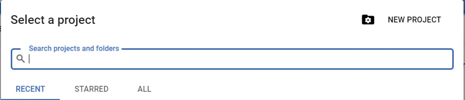
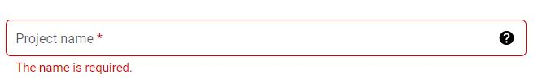
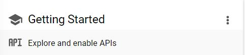
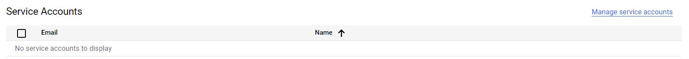
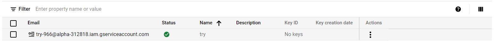

# Data Extraction using Google Spreadsheet - Python
## • Recommended Softwares
1. PyCharm Editor
2. Python 3.7 **(Python 3.7.9 is used for scripting)**
3. **Python virtual environment** is recommended.

## • Steps to Perform
### 1. Creating a Gmail Account
### 2. Creating a Google Spreadsheet on Gmail Account
* Log-in to your gmail account
* On the top right corner, under the **Google Apps** option, click on **Sheets**.
* Select the **Blank** option that will open a new spreadsheet.
* Insert some column names and add rows data under them.
* Rename the sheet and save the file with an appropriate name. 

### 3. Initializing a Project in Developers Console
* Go to https://console.developers.google.com
* To create a new project, click on the drop-down menu on the top left side of the page.
* On the new dialogue box, click on the **New Project** option.

* Name your project and click the **Create** button below.

### 4. Enabling GoogleSheets API
* Under the **Getting Started** tab, click on **Explore and Enable APIs**.

 

* Click on the **ENABLE APIS AND SERVICES** option.

* Select **Google Sheets API** and enable it.
* Click on **Credentials** on the left side of the page
* Create a service account compatible with the enabled Spreadsheets API by clicking on **Manage service accounts** option on the right.

* Click **CREATE SERVICE ACCOUNT** option. Give any name to the account and click **CREATE**.
* Assign the account with **Editor** role under the **Project** option. Click **CONTINUE**.
* Click **Done**. A service account will be created as shown below

### 5. Sharing Google Sheet with Service Account
* Open the already created google spreadsheet.
* Click on the **Share** button on the top right corner.
* Enter the service account email created in the previous steps.

* Uncheck **Notify People** option and click **Share** with **Editor** option.

### 6. Log-in to the Service Account
* Click on the service account email.

* Select the **Keys** tab.
* Under the **Add Key** option, click on **Create new key**.
* Select **JSON** and click **Create**. The user will be prompted to save the secret key in json format.
* To keep things simple, rename the json file. For e.g. **keys.json**. Place it under the root directory. (**Perform this after cloning the repo in Step 7**)

### 7. Clone the GitHub Repository

* Download and unzip the repository.

* Navigate inside the root folder of the repository using the terminal.

  `$ cd google_spreadsheet_python`
  
* Install the python packages using the requirements.txt file.

  `$ pip install -r requirements.txt`
  
* Open the spreadsheet in gmail account and copy the url. For e.g. **https://docs.google.com/spreadsheets/d/SPREADSHEET_ID/edit#gid=0**. Here just keep the **SPREADSHEET_ID** and remove the rest. Assign this string to the **SAMPLE_SPREADSHEET_ID** variable in the **main.py** file inside the root directory.
* Inside the **main.py** script, for the value of the **range** parameter of the **sheet.values().get(range = Sheet_Name!A1:E16)** function, replace **Sheet_Name** with the sheet name of the google sheet to be extracted. Also replace **A1:E16** with excel coordinates for complete data from top left to bottom right of the specific sheet to be extracted.
* After making the above changes, execute the python script.

  `$ python main.py`
  
