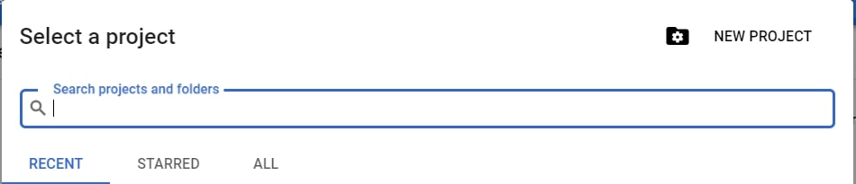

# Data Extraction using Google Spreadsheet (Python) In Development
## Recommended Softwares
* PyCharm Editor
* Python 3.7 **(Python 3.7.9 is used for scripting)**

## Steps to Perform
## Google Documentation
### Creating a Gmail Account
### Creating a Google Spreadsheet on Gmail Account
* Log-in to your gmail account
* On the top right corner, under the **Google Apps** option, click on **Sheets**.
* Select the **Blank** option that will open a new spreadsheet.
* Insert some column names and add rows data under them.
* Rename the sheet and save the file with an appropriate name. 

### Initializing a Project in Developers Console
* Go to https://console.developers.google.com
* To create a new project, click on the drop-down menu on the top left side of the page.
* On the new dialogue box, click on the **New Project** option.

### Downloading the Repository

* Open the terminal.

* Navigate inside the root folder of the repository.

  `$ cd google_spreadsheet_python`
  
* Install the python packages using the requirements.txt file.

  `$ pip install -r requirements.txt`
  

**Python virtual environment** is recommended.
