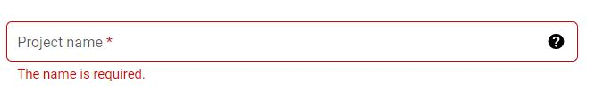
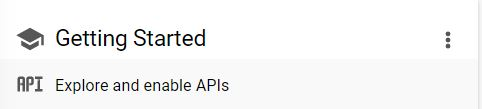
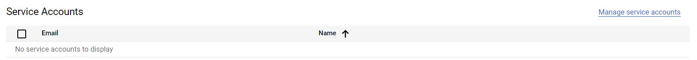
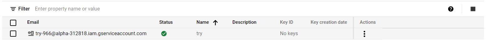

# Data Extraction using Google Spreadsheet (Python) -- In Development
## Recommended Softwares
* PyCharm Editor
* Python 3.7 **(Python 3.7.9 is used for scripting)**

## Steps to Perform
## Google Documentation
### Creating a Gmail Account
### Creating a Google Spreadsheet on Gmail Account
* Log-in to your gmail account
* On the top right corner, under the **Google Apps** option, click on **Sheets**.
* Select the **Blank** option that will open a new spreadsheet.
* Insert some column names and add rows data under them.
* Rename the sheet and save the file with an appropriate name. 

### Initializing a Project in Developers Console
* Go to https://console.developers.google.com
* To create a new project, click on the drop-down menu on the top left side of the page.
* On the new dialogue box, click on the **New Project** option.

* Name your project and click the **Create** button below.

### Enabling GoogleSheets API
* Under the **Getting Started** tab, click on **Explore and Enable APIs**.

 

* Click on the **ENABLE APIS AND SERVICES** option.

* Select **Google Sheets API** and enable it.
* Click on **Credentials** on the left side of the page
* Create a service account compatible with the enabled Spreadsheets API by clicking on **Manage service accounts** option on the right.

* Click **CREATE SERVICE ACCOUNT** option. Give any name to the account and click **CREATE**.
* Assign the account with **Editor** role under the **Project** option. Click **CONTINUE**.
* Click **Done**. A service account will be created as shown below

### Sharing Google Sheet with Service Account
* Open the already created google spreadsheet.
* Click on the **Share** button on the top right corner.
* Enter the service account email created in the previous steps.

* Uncheck **Notify People** option and click **Share** with **Editor** option.

### Log-in to the Service Account
* Click on the service account email.

* Select the **Keys** tab.
* Under the **Add Key** option, click on **Create new key**.
* Select **JSON** and click **Create**. The user will be prompted to save the secret key in json format.
* To keep things simple, rename the json file. For e.g. **keys.json**. Place it under the root directory.

### Downloading the Repository

* Open the terminal.

* Navigate inside the root folder of the repository.

  `$ cd google_spreadsheet_python`
  
* Install the python packages using the requirements.txt file.

  `$ pip install -r requirements.txt`
  

**Python virtual environment** is recommended.
